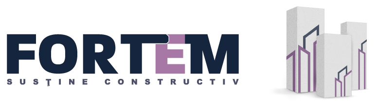
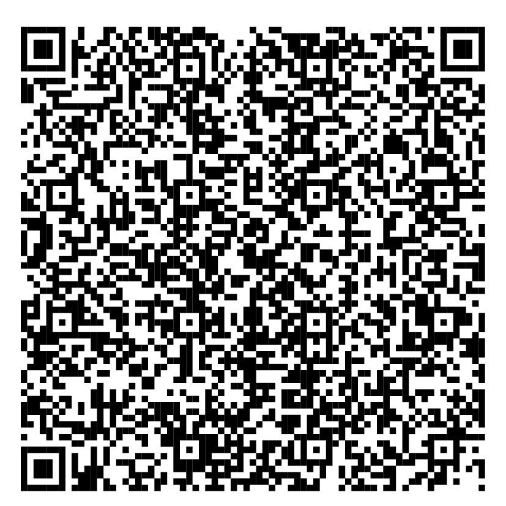

<html lang="ro">
<head>
  <meta charset="UTF-8">
  <meta name="viewport" content="width=device-width, initial-scale=1.0">
  <title>Carte-vizită Valentin Nedea</title>
  <link href="https://fonts.googleapis.com/css2?family=Open+Sans:wght@400;600;700&display=swap" rel="stylesheet">
  
</head>
<body>
  

    

      
      

        
VALENTIN

        
NEDEA

        
Manager Zonal București & Constanța

      

    

    

    

      
Scanează QR pentru vCard

      
    

    

      

        📞 <a href="tel:+40742063318">+4 0742 063 318</a>
        <a class="button" href="tel:+40742063318">Sună</a>
      

      

        ✉️ <a href="mailto:valentin.nedea@fortem.ro">valentin.nedea@fortem.ro</a>
        <a class="button" href="mailto:valentin.nedea@fortem.ro">Email</a>
      

      

        📥 <a href="valentin-nedea.vcf" download>Descarcă vCard</a>
        <a class="button" href="valentin-nedea.vcf" download>vCard</a>
      

    

    

      Băneasa Business & Technology Park 
      Șoseaua București - Ploiești 42-44 
      Corp A, etaj 2, București, 015011
    

  

</body>
</html>
